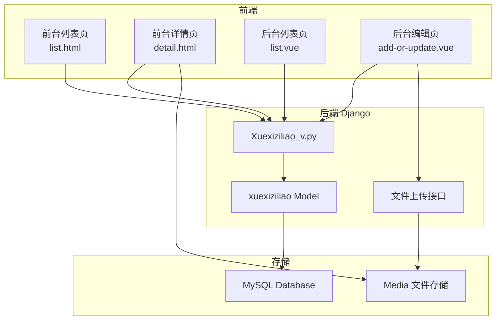

# Design Document: 学习资料下载功能

## Overview

本设计将学习资料模块从"购买"模式转换为"下载"模式。主要涉及以下改动：
- 数据模型：移除价格字段，新增文件字段
- 前台页面：移除购买相关UI，新增下载按钮
- 后台页面：移除价格输入，新增文件上传

## Architecture



## Components and Interfaces

### 1. 数据模型修改 (main/models.py)

**修改 xuexiziliao 模型：**
- 移除 `price` 字段
- 新增 `wenjian` 字段（CharField，存储文件路径）

```python
class xuexiziliao(BaseModel):
    # 保留字段
    ziliaomingcheng = models.CharField(max_length=255, verbose_name='资料名称')
    fengmian = models.CharField(max_length=255, verbose_name='封面')
    xiangqing = models.TextField(verbose_name='详情')
    thumbsupnum = models.IntegerField(verbose_name='赞')
    crazilynum = models.IntegerField(verbose_name='踩')
    
    # 新增字段
    wenjian = models.CharField(max_length=255, null=True, verbose_name='文件')
    
    # 移除字段: price
```

### 2. 前台详情页修改 (templates/front/pages/xuexiziliao/detail.html)

**移除元素：**
- 价格显示区域 (`v-if="detail.price"`)
- 购买数量选择器 (`.num-picker`)
- "添加到购物车"按钮 (`@click="addCartTap"`)
- "立即购买"按钮 (`@click="buyTap"`)

**新增元素：**
- 下载按钮，当 `detail.wenjian` 存在时显示

```html
<button v-if="detail.wenjian" @click="downloadFile(detail.wenjian)" 
        type="button" class="layui-btn btn-download">
    下载资料
</button>
```

**新增方法：**
```javascript
downloadFile(fileUrl) {
    if (fileUrl) {
        window.open(fileUrl, '_blank');
    } else {
        layer.msg('暂无可下载文件', { time: 2000, icon: 5 });
    }
}
```

### 3. 前台列表页修改 (templates/front/pages/xuexiziliao/list.html)

**移除元素：**
- 价格显示区域 (`v-if="item.price"`)

### 4. 后台编辑页修改 (templates/front/admin/src/views/modules/xuexiziliao/add-or-update.vue)

**移除元素：**
- 价格输入框 (`prop="price"`)

**新增元素：**
- 文件上传组件

```vue
<el-col :span="24">  
  <el-form-item class="upload" v-if="type!='info' && !ro.wenjian" label="文件" prop="wenjian">
    <file-upload
      tip="点击上传文件"
      action="file/upload"
      :limit="1"
      :multiple="false"
      :fileUrls="ruleForm.wenjian?ruleForm.wenjian:''"
      @change="wenjianUploadChange"
    ></file-upload>
  </el-form-item>
  <div v-else>
    <el-form-item v-if="ruleForm.wenjian" label="文件" prop="wenjian">
      <el-button type="primary" @click="download(ruleForm.wenjian)">下载文件</el-button>
    </el-form-item>
  </div>
</el-col>
```

## Data Models

### xuexiziliao 表结构变更

| 字段名 | 类型 | 说明 | 操作 |
|--------|------|------|------|
| id | BigInteger | 主键 | 保留 |
| addtime | DateTime | 创建时间 | 保留 |
| ziliaomingcheng | VARCHAR(255) | 资料名称 | 保留 |
| fengmian | VARCHAR(255) | 封面图片 | 保留 |
| xiangqing | Text | 详情 | 保留 |
| thumbsupnum | Integer | 赞数 | 保留 |
| crazilynum | Integer | 踩数 | 保留 |
| price | Float | 价格 | **移除** |
| wenjian | VARCHAR(255) | 文件路径 | **新增** |

## Correctness Properties

*A property is a characteristic or behavior that should hold true across all valid executions of a system-essentially, a formal statement about what the system should do. Properties serve as the bridge between human-readable specifications and machine-verifiable correctness guarantees.*

### Property 1: 下载按钮条件显示

*For any* 学习资料详情页，当且仅当资料包含非空的 wenjian 字段时，下载按钮应该显示

**Validates: Requirements 2.5**

### Property 2: 文件格式支持

*For any* 上传的文件，只要是常见文档格式（PDF、DOC、DOCX、PPT、PPTX、XLS、XLSX、ZIP等），系统应该成功保存并允许下载

**Validates: Requirements 4.4, 5.2**

## Error Handling

| 场景 | 处理方式 |
|------|----------|
| 文件字段为空时点击下载 | 显示提示"暂无可下载文件" |
| 文件不存在或已删除 | 显示404错误页面或提示 |
| 文件上传失败 | 显示上传失败提示，允许重试 |

## Testing Strategy

### 单元测试
- 验证模型字段变更正确
- 验证表单验证规则正确

### 集成测试
- 验证文件上传流程
- 验证文件下载流程

### UI测试
- 验证前台详情页移除了购买相关元素
- 验证前台详情页显示下载按钮
- 验证后台编辑页移除了价格输入框
- 验证后台编辑页显示文件上传组件
